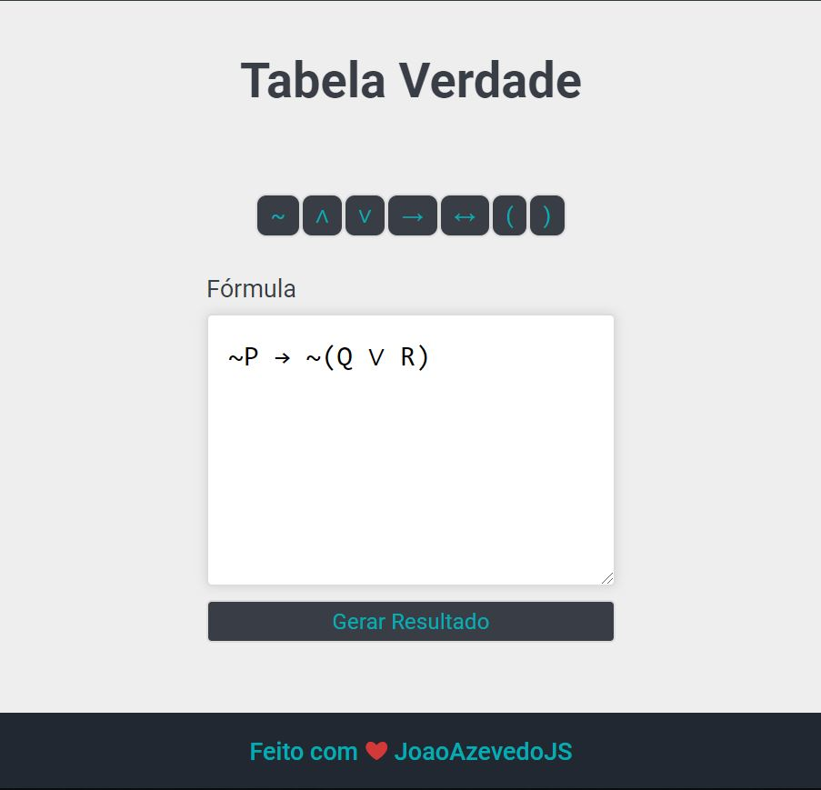
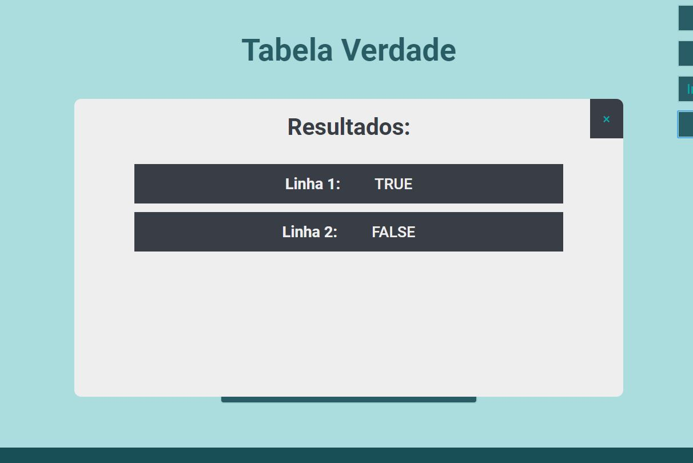

<header align="center">
	<h1>Tabela Verdade</h1>
</header>

<main>
	<h2>Coloque a formula</h2>
	
	
Adicione as linhas

	
	
E gere seu resultado

	
</main>

<footer align="center">
	<h3>
		Obrigado! By
		
			João Azevedo
		
	</h3>
</footer>

